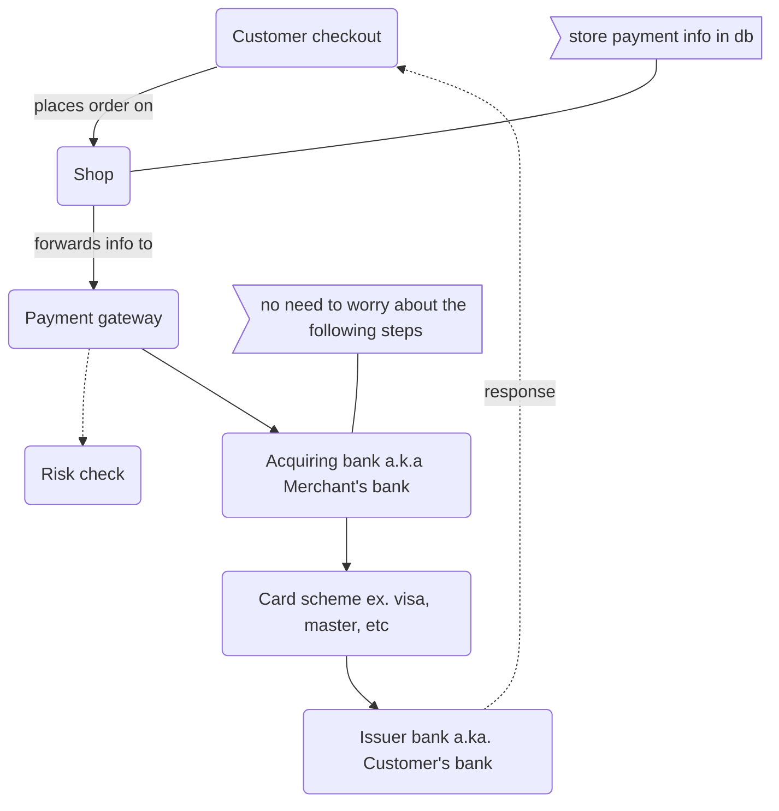

# Payment Service

LAST UPDATED on 17-10-2023 by @Isuru

---

Code for the payment management service for the e-commerce application.

## Flow


## Database
```mysql
create database payment;

create table payment_record(
id int not null auto_increment,
user_id int not null,
amount int not null,
primary key(id)
);
```