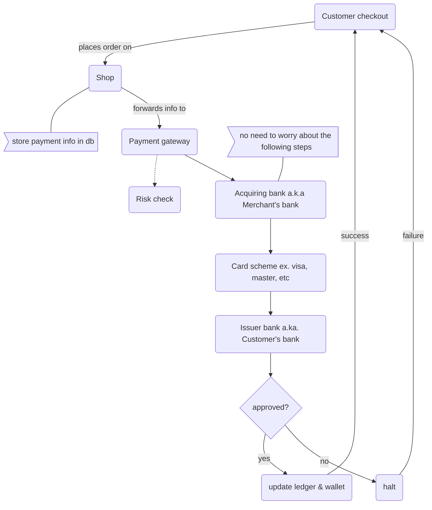

# Payment Service

LAST UPDATED on 20-10-2023 by @Isuru

---

Code for the payment management service for the e-commerce application.

## Flow


## Database
```mysql
create database payment;

create table payment_record(
   id INT not null auto_increment,
   user_id INT not null,
   amount DECIMAL not null,
   datetime TIMESTAMP not null,
   status VARCHAR(10) not null,
   primary key(id)
);

```

## Important
>  Sensitive credentials are stored in the .env file. 
> <br>
> In order to run the application, create a .env file at the root folder, sign up for a sandbox paypal account
> and add the CLIENT_ID and CLIENT_SECRET to the .env file.